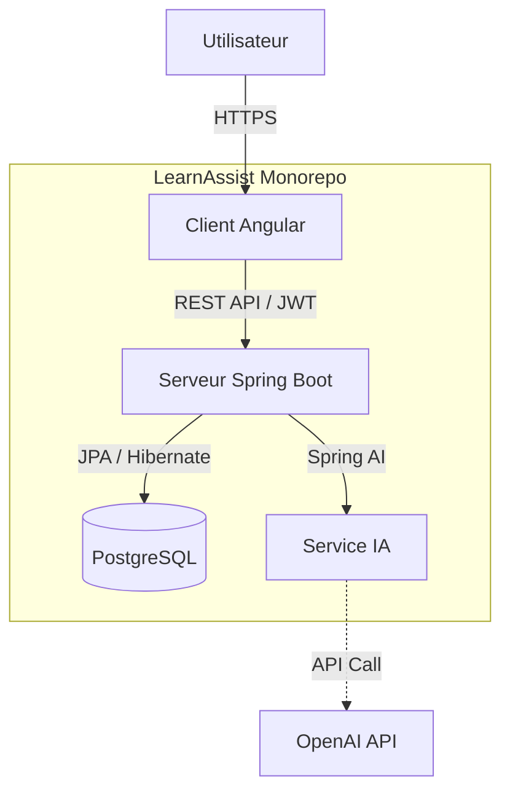

# 🎓 LearnAssist

> **Plateforme LMS Intelligente connectant Formateurs et Apprenants.**

**LearnAssist** est une plateforme de gestion de l'apprentissage (LMS) moderne conçue pour faciliter la création, la distribution et le suivi de formations en ligne. Elle intègre un **assistant IA** pour accompagner les participants dans leur parcours.

---

## 🏗️ Architecture du Projet

---

## 🎬 Démo et Aperçu

> *Une image vaut mille mots. Voici un aperçu de l'application.*

| Page d'accueil | Espace Participant |
|:---:|:---:|
|
  |  |
| *Landing page moderne et accueillante* | *Suivi des cours et progression* |

| Espace Instructeur | ChatBot IA |
|:---:|:---:|
| 
 |  |
| *Gestion des formations et statistiques* | *Assistance intelligente en temps réel* |

---

## 🚀 Fonctionnalités Principales

### 👨‍🎓 Espace Participant
*   **Catalogue de Formations** : Exploration et inscription aux cours disponibles.
*   **Suivi Pédagogique** : Progression détaillée par chapitre et par cours.
*   **Assistant IA (ChatBot)** : Support instantané basé sur l'IA pour répondre aux questions sur le contenu.
*   **Gestion de Profil** : Personnalisation du profil et suivi des certifications.

### 👨‍🏫 Espace Instructeur
*   **Création de Contenu** : Éditeur intuitif pour créer des formations, des chapitres et des articles.
*   **Gestion des Inscriptions** : Validation et suivi des demandes de participation.
*   **Tableau de Bord** : Vue d'ensemble de l'activité et des statistiques.

---

## 🛠️ Stack Technique

### Frontend (`/Learn_Assist_Frontend`)
*   **Framework** : Angular 18
*   **Styling** : Tailwind CSS
*   **Icônes** : Lucide Angular
*   **Architecture** : Modular Components, Guards, Interceptors.

### Backend (`/Learn_Assist_Backend`)
*   **Framework** : Spring Boot 3.4.2
*   **Base de Données** : PostgreSQL (JPA/Hibernate)
*   **Sécurité** : Spring Security 6 (JWT)
*   **IA** : Spring AI (Intégration OpenAI)

---

## ⚙️ Installation et Configuration

### Prérequis
*   Node.js (v18+)
*   Java JDK 17+
*   PostgreSQL
*   Maven

### 1. Configuration du Backend

1.  Naviguez dans le dossier backend :
    \`\`\`bash
    cd Learn_Assist_Backend
    \`\`\`
2.  Configurez vos variables d'environnement. Copiez le fichier d'exemple :
    \`\`\`bash
    cp src/main/resources/application.yml.example src/main/resources/application.yml
    \`\`\`
3.  Éditez `src/main/resources/application.yml` avec vos propres informations :
    *   Identifiants PostgreSQL (`url`, `username`, `password`)
    *   Clé API OpenAI (`spring.ai.openai.api-key`)
    *   Secret JWT (`jwt.secret`)

4.  Lancez l'application :
    \`\`\`bash
    ./mvnw spring-boot:run
    \`\`\`

### 2. Configuration du Frontend

1.  Naviguez dans le dossier frontend :
    \`\`\`bash
    cd Learn_Assist_Frontend/LearnAssist
    \`\`\`
2.  Installez les dépendances :
    \`\`\`bash
    npm install
    \`\`\`
3.  Lancez le serveur de développement :
    \`\`\`bash
    ng serve
    \`\`\`
4.  Accédez à l'application sur `http://localhost:4200`.

---

## 🤝 Contribution

Les contributions sont les bienvenues ! Pour des changements majeurs, veuillez d'abord ouvrir une issue pour discuter de ce que vous souhaitez changer.

## 📄 Licence

Ce projet est sous licence MIT.
